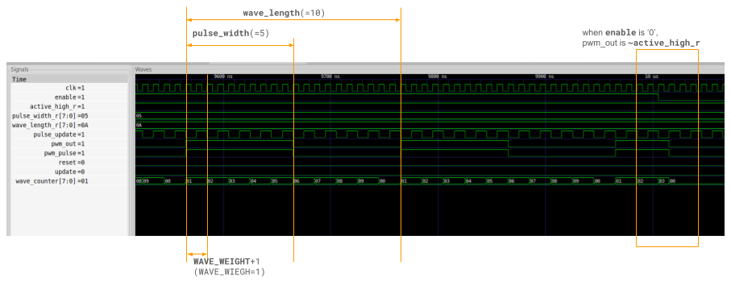

# mAWG

This mini AWG `mAWG` generates waveform by reading data from Wave Pattern Storage according to Chunk Storage entries.

## Overview


This module starts to run when `kick` is asserted. During the module runs, `busy` is asserted. This module generates waves according to specified parameters, however, users can stop the module anytime by asserting `force_stop`. When and only when this module generates valid wave, `wave_out` is asserted.

### Definition of `Wave`

Wave is generated by the combination of multiple chunks defined by the parameters of the Chunk Storage entry.
Each Chunk Storage entry contains `chunk_length`, `chunk_offset`, and `chunk_repetition`.
The `chunk_offset` and `chunk_length` specify the start address and length of `Wave Pattern Storage` to read for each chunk.
The `chunk_repetition` gives the repetitions of the chunk.
The number of entries read from Chunk Storage is given by `ctrl_length`,
and `repetition` gives the number of repetitions of reading the sequence of chunks.


### Parameters

| Name             | Description                          |
|------------------|--------------------------------------|
| CTRL\_DEPTH      | depth of regfile\_i                  | 
| WAVE\_DEPTH      | depth of wave pattern storage        |
| WAVE\_WIDTH      | bit-width of wave pattern            |
| WAVE\_RAM\_DELAY | read latency of wave pattern storage |

## Test

```
cd tb
make
```

# PWM

pwm.v is a simple PWM implementation.

This module generate PWM output from `wave_length` and `pulse_width`. The `wave_length` corresponds to total wave length and the `pulse_width` corresponds to the length pulse active. The polarity of active period is deffined by `active_high`. In case that `wave_length`, `pulse_width`, and `active_high` are `'d10`, `'d2`, and `'b1`; the PWM module generates 20% duty active-high output.
The parameter `WAVE_LEN_WIDTH` should be enough bit-width for `wave_length` and `pulse_width`.
The input value of `wave_length`, `pulse_width`, and `active-high` is stored into the internal registers at `update` rising.

The parameter `WAVE_WEIGHT` corresponds to common weight for `wave_length` and `pulse_width`. The PWM outputs will be `WAVE_WEIGHT+1` times slower than given clock period.


