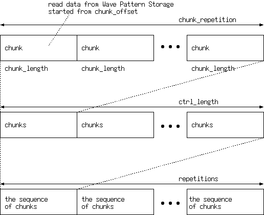

# mAWG

This mini AWG `mAWG` generates waveform by reading data from Wave Pattern Storage according to Chunk Storage entries.

## Overview


### Definition of `Wave`

Wave is generated by the combination of multiple chunks defined by the parameters of the Chunk Storage entry.
Each Chunk Storage entry contains `chunk_length`, `chunk_offset`, and `chunk_repetition`.
The `chunk_offset` and `chunk_length` specify the start address and length of `Wave Pattern Storage` to read for each chunk.
The `chunk_repetition` gives the repetitions of the chunk.
The number of entries read from Chunk Storage is given by `chunk_length`,
and `repetition` gives the number of repetitions of reading the sequence of chunks.




### Parameters

| Name             | Description                          |
|------------------|--------------------------------------|
| CTRL\_DEPTH      | depth of regfile\_i                  | 
| WAVE\_DEPTH      | depth of wave pattern storage        |
| WAVE\_WIDTH      | bit-width of wave pattern            |
| WAVE\_RAM\_DELAY | read latency of wave pattern storage |

## Test

```
cd tb
make
```
